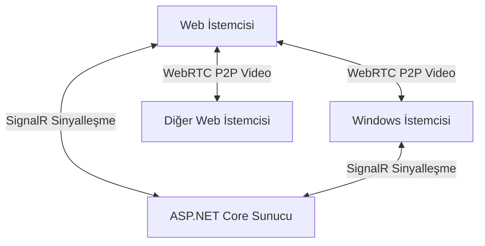

# 🎥 WebRTC Pro — Gerçek Zamanlı İletişim Platformu

[](https://dotnet.microsoft.com/)
[](https://learn.microsoft.com/aspnet/core/signalr/)
[](https://webrtc.org/)
[](https://github.com/ferhatolmez/WebRTCProjesi/actions)
[](LICENSE)

Profesyonel, yüksek performanslı **gerçek zamanlı video görüşme, ses ve mesajlaşma** platformu.  
Modern glassmorphic Web Client ile standartlara uyumlu Windows C# Desktop Client birlikte, aynı odada çalışır.

---

---

## 🚀 Hızlı Başlangıç (Nasıl Kullanılır?)

Projeyi hemen test etmek için aşağıdaki adımları izleyebilirsiniz:

### 1. Web Üzerinden Bağlan (Canlı Demo)
Herhangi bir kurulum yapmadan doğrudan tarayıcınızdan giriş yapabilirsiniz:  
👉 **[WebRTC Pro Canlı Demo](https://webrtcprojesi.onrender.com)**

*   Bir **Oda ID** (örneğin: `oda1`) ve **Kullanıcı Adı** girip "Bağlan" deyin.
*   "Görüşmeyi Başlat" butonu ile kameranızı aktif edin.

### 2. Windows Uygulamasını İndir (Masaüstü)
Tarayıcı ile Windows uygulaması arasında görüşmek için masaüstü istemcisini indirin:  
👉 **[WebRTCWindowsClient_Release.zip İndir](https://github.com/ferhatolmez/WebRTCProjesi/blob/master/WebRTCWindowsClient_Release.zip)**

*   Zipli dosyayı indirin ve klasöre çıkarın.
*   `WebRTCWindowsClient.exe` dosyasını çalıştırın.
*   Tarayıcıdakiyle **aynı Oda ID**'yi yazarak "Connect" butonuna basın.
*   "Start Video Call" diyerek çapraz platform video görüşmesini başlatın!

---

## ✨ Özellikler

### 🌐 Web Client (Tarayıcı)
| Özellik | Açıklama |
|---------|----------|
| **Glassmorphic UI** | Dark/Light tema, cam efekti, mikro-animasyonlar |
| **Gerçek Zamanlı Video** | Tarayıcı WebRTC API ile düşük gecikme |
| **Ekran Paylaşımı** | Doğrudan tarayıcıdan masaüstü paylaşımı |
| **Sohbet Sistemi** | Anlık mesajlaşma, XSS korumalı |
| **Tam Responsive** | Mobil, tablet ve masaüstü uyumlu |

### 🖥️ Windows Client (SIPSorcery)
| Özellik | Açıklama |
|---------|----------|
| **WebRTC P2P** | SDP Offer/Answer ve ICE candidate standartları |
| **VP8 Video Codec** | Karşı tarafın görüntüsünü decode edip gösterme |
| **Lokal Video** | Kamera görüntüsünü anında önizleme (PictureBox) |
| **Hybrid Relay** | Chrome uyumluluğu için optimize edilmiş akış teknolojisi |

---

## 🏗️ Mimari ve Akış



| Yön | Teknoloji | Durum |
|-----|-----------|-------|
| **Web ↔ Web** | WebRTC P2P (VP8/Opus) | ✅ Aktif |
| **Web ↔ Windows** | WebRTC P2P (VP8) | ✅ Aktif |
| **Windows ↔ Web** | SignalR Relay (JPEG/Base64) | ✅ Aktif (Fallback) |

---

## 📂 Proje Yapısı

```
WebRTCProjesi/
├── WebRTCSignalServer/           # ASP.NET Core SignalR Sunucusu
│   ├── wwwroot/
│   │   ├── index.html            # Web Client SPA
│   │   ├── css/ & js/            # Stil ve Mantık dosyaları
├── WebRTCWindowsClient/          # WinForms + SIPSorcery Desktop Client
│   ├── Form1.cs                  # Ana form mantığı
└── WebRTCWindowsClient_Release.zip # Derlenmiş hazır sürüm
```

---

## 🔧 Teknik Detaylar & API

| Endpoint | Metot | Açıklama |
|----------|-------|----------|
| `/health` | `GET` | Sunucu sağlık kontrolü |
| `/api/stats` | `GET` | Aktif kullanıcı ve oda istatistikleri |
| `/webrtchub` | `WS` | SignalR WebSocket Hub |

---

## 📦 Bağımlılıklar

| Bileşen | Teknoloji | Versiyon |
|---------|-----------|----------|
| **Sunucu** | ASP.NET Core, SignalR Core | .NET 8.0 |
| **Web Client** | SignalR JS Client, Browser WebRTC API, Lucide Icons | — |
| **Windows Client** | SIPSorcery, SIPSorceryMedia.Windows, SIPSorceryMedia.Encoders | 10.x |
| **İletişim** | Microsoft.AspNetCore.SignalR.Client | 9.0.6 |
| **Serileştirme** | System.Text.Json | 9.0.6 |

---

## 🔗 API Endpoint'leri

| Endpoint | Metot | Açıklama |
|----------|-------|----------|
| `/` | `GET` | Web Client (index.html) |
| `/health` | `GET` | Sunucu sağlık kontrolü |
| `/api/stats` | `GET` | Bağlı kullanıcı ve aktif oda sayısı |
| `/webrtchub` | `WS` | SignalR WebSocket Hub |

### SignalR Hub Metotları

| Metot | Yön | Açıklama |
|-------|-----|----------|
| `JoinRoom` | Client → Server | Odaya katılma |
| `LeaveRoom` | Client → Server | Odadan ayrılma |
| `SendOffer` | Client → Client | WebRTC SDP Offer gönderme |
| `SendAnswer` | Client → Client | WebRTC SDP Answer gönderme |
| `SendIceCandidate` | Client → Client | ICE Candidate gönderme |
| `SendMessage` | Client → Client | Chat mesajı gönderme |
| `SendVideoFrame` | Client → Client | Base64 video frame aktarımı |

---

## 🔧 Teknik Detaylar

### Port Yapılandırması
Sunucu varsayılan olarak **port 5050** üzerinde çalışır. Bu, port 5000'in Windows/macOS sistemlerinde sıkça kullanılması nedeniyle tercih edilmiştir. Port değiştirmek için:
- `WebRTCSignalServer/Program.cs` → `app.Run("http://localhost:PORT")`
- `WebRTCSignalServer/wwwroot/index.html` → SignalR bağlantı URL'si
- `WebRTCWindowsClient/Form1.cs` → Varsayılan sunucu URL'si

### Hibrit Video Mimarisi
Proje, **akıllı hibrit mimari** kullanır:
- **Saf WebRTC (P2P):** Tarayıcılar arası ve tarayıcıdan Windows'a video akışı
- **Base64 SignalR Fallback:** Windows'tan tarayıcıya video akışı (~20 FPS, %60 JPEG)

Bu yaklaşım, SIPSorcery VP8 encoder'ın Chrome ile yaşadığı codec uyumsuzluğunu transparan şekilde çözer.

### GitHub Actions CI
Her `push` ve `pull_request` işleminde otomatik olarak:
1. `.NET 8 SDK` kurulumu
2. `WebRTCSignalServer` derlemesi
3. `WebRTCWindowsClient` derlemesi

---

## 📄 Lisans

MIT License — Detaylar için [LICENSE](LICENSE) dosyasına bakın.

---

*Geliştirici: **Ferhat Ölmez***
